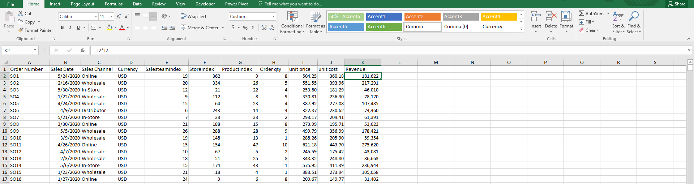
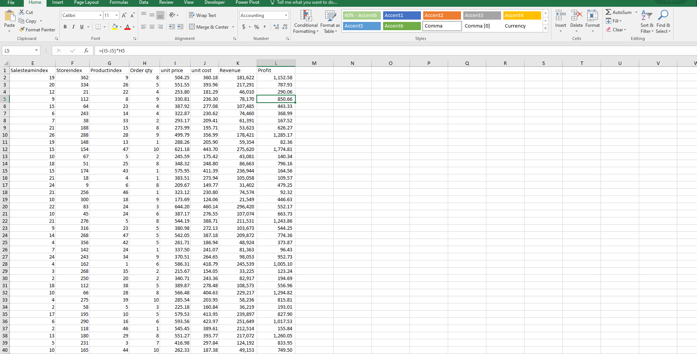
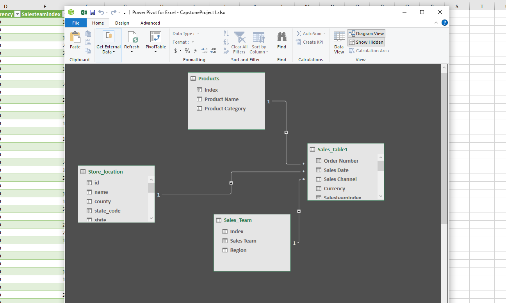
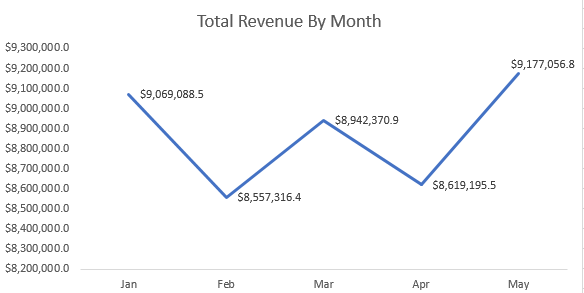
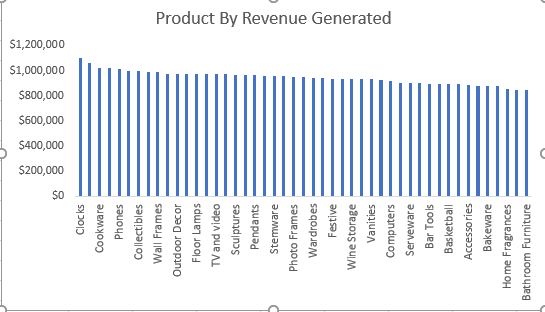
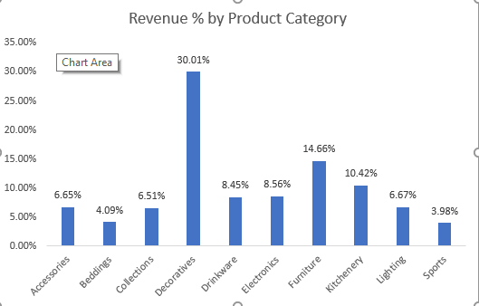
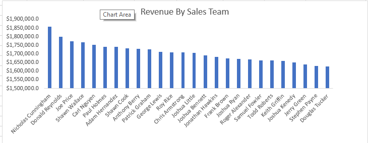
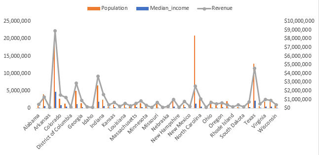
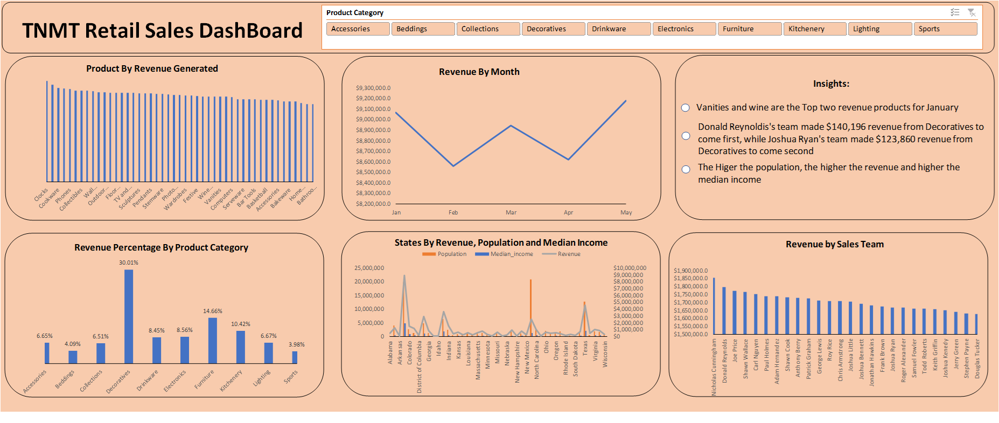

# TMNT-Sales-Analysis

## Introduction
My current training at Utiva included a Capstone Project focused on the TMNT stores dataset. This project allowed me to practice my data cleaning, analysis, and visualization skills using Excel. Additionally, I created a reporting dashboard to showcase my findings from the dataset. Overall, the project was an excellent opportunity to apply what I learned in the training and gain hands-on experience with real-world data.

## Problem statement 
- What is the total revenue?
- What is the total Profit made

We were expected to make a report for 
-	Revenue trend?
-	Product by revenue?
-	Revenue Contribution (%) of the product categories?
-	Sales team by revenue?
-	State by revenue, also showing their population and the median income per state?

Create a dashboard with the report and sliceable by:
-	Product category

Include a textbox to highlight the following insights:
-	Which are the 2 top revenue products in January
-	Which sales team made the most revenue from Decoratives in March?
-	What is the relationship between revenue, population, and median income of the states

## Skills/Concepts Demonstrated
- Excel
- PowerPivot
- PivotTables
- Dashboard 
- Data Modelling
- Data Preparation / Cleaning:

The dataset was shared with students of Utiva. it consists of data from January to May 2020 showing sales of the TMNT store, It has 4 sheets; 
- Sales Table    (11 columns and 19568 rows)
- Product  (3 columns and 48 rows)
- Sales team  (2 columns and 29 rows)
- Store location    (15 columns and 368 rows) 

## Data cleaning and transformation
New columns were created for profit and revenue

Revenue

Profit

Formatted all sheets as tables.

Created relationships between tables

## Created  pivot tables that summarize;

1. Revenue trend

From the Visuals of revenue trend: revenue was the highest in May while February brought the least revenue 

2. Products by revenue

From the Visual of Product revenue: Clocks brought in more profit to the store while bathroom furniture brought in the least revenue

3. Revenue contribution (%) of the product categories

From the Visual of revenue contribution by product categories: Decorative brought in more profit to the store while sports brought in the least revenue

4. Sales Team by Revenue

From the Visuals Sales team by revenue: Nicholas Cunningham’s team made the most profit while Douglas Tuckers’s team made the least profit 

5. State by revenue, also showing their population and the median income per state

From the Visuals State by revenue, also showing their population and the median income per state: we understood that a higher population leads to higher revenue

## Insights :
1.	In January, vanities and wine were our top two revenue-generating products.
2.	Among our teams, Donald Reynolds's team generated the most revenue from Decoratives in January, bringing in $140,196 and earning first place. Joshua Ryan's team came in second, generating $123,860 in revenue from Decoratives.
3.	We've observed that revenue tends to increase with population and median income. The higher the population and median income in a given area, the higher the revenue tends to be.
 
 
## Dashboard 

## Recommendation and Conclusion
1.	Teams that generate the highest revenue should be rewarded, while teams that have the lowest revenue should be evaluated to identify areas for improvement.
2.	To maximize our reach, we should consider opening more stores in the top 5 states with the highest population.
3.	It's important to ensure that decorative products are always available in all of our store locations to meet the demands of our customers.

